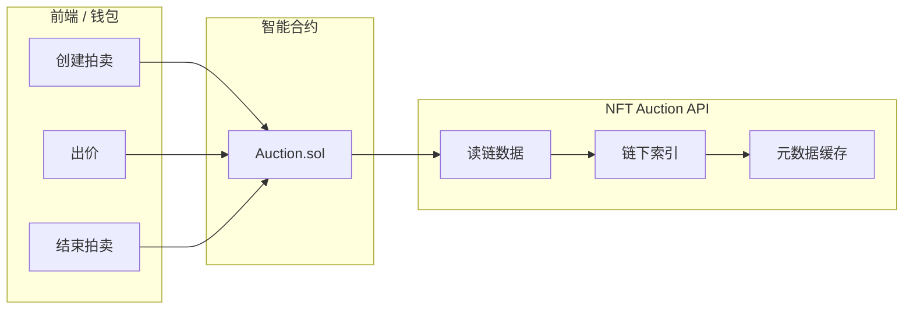
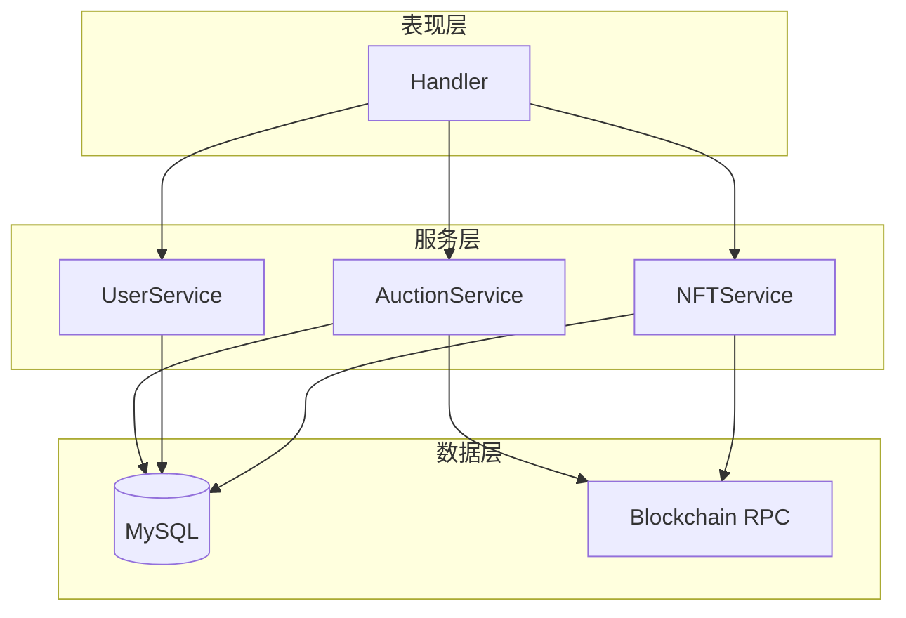
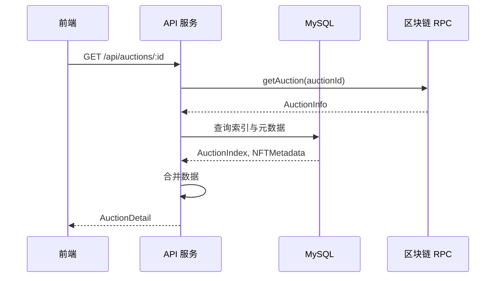
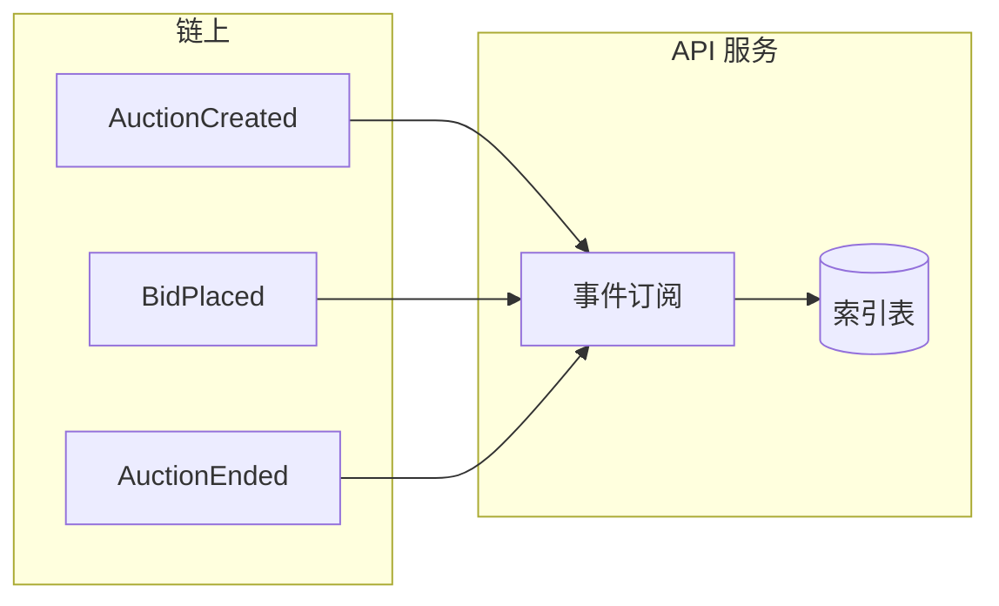
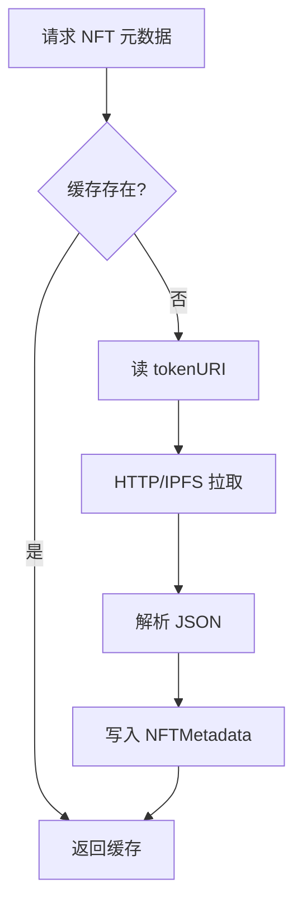

# NFT Auction API 架构设计文档

> 基于 [nft-auction](https://github.com/example/nft-auction) 智能合约与 [my-blog](/home/cjq_ubuntu/web3/projects/go-task/task4/my-blog) 后端架构的 API 设计规范。

---

## 一、项目概述

### 1.1 项目名称

**NFT Auction API**

### 1.2 定位

为 NFT 拍卖智能合约提供 REST API 接口，实现：

- **链下索引**：拍卖列表、出价记录、用户关联
- **元数据查询**：NFT tokenURI 解析与缓存
- **辅助能力**：准备合约调用参数、索引同步、状态聚合

### 1.3 技术栈

| 技术 | 说明 |
|------|------|
| Go | 1.21+ |
| Gin | Web 框架 |
| GORM | ORM，MySQL |
| go-ethereum | 以太坊 RPC 调用 |
| JWT | 用户认证 |

### 1.4 职责边界



- **写操作**（创建拍卖、出价、结束/取消）：由前端/钱包直接调用合约
- **读操作**：API 从链上读取 + 链下索引，提供聚合查询

---

## 二、架构设计

### 2.1 目录结构（参考 my-blog）

```
nft-auction-api/
├── cmd/
│   └── app/
│       └── main.go              # 应用入口
├── internal/
│   ├── app/
│   │   └── router.go            # 路由配置
│   ├── config/
│   │   ├── app.go               # 应用配置
│   │   ├── database.go          # 数据库配置
│   │   └── blockchain.go        # 区块链配置
│   ├── handler/
│   │   ├── user_handler.go
│   │   ├── auction_handler.go
│   │   ├── bid_handler.go
│   │   └── nft_handler.go
│   ├── service/
│   │   ├── user_service.go
│   │   ├── auction_service.go
│   │   ├── bid_service.go
│   │   ├── nft_service.go
│   │   └── jwt_service.go
│   ├── model/
│   │   ├── user.go
│   │   ├── auction_index.go
│   │   ├── bid_index.go
│   │   └── nft_metadata.go
│   ├── blockchain/
│   │   ├── client.go            # RPC 客户端
│   │   ├── auction_contract.go  # 合约调用封装
│   │   └── events.go            # 事件解析
│   ├── middleware/
│   │   ├── auth.go
│   │   └── cors.go
│   ├── errors/
│   │   └── app_error.go
│   ├── response/
│   │   └── response.go
│   └── logger/
│       └── logger.go
├── docs/
│   └── ARCHITECTURE.md
├── scripts/
│   └── api/                     # API 测试脚本
├── go.mod
└── README.md
```

### 2.2 分层架构



### 2.3 数据流



---

## 三、合约接口映射

基于 [IAuction.sol](/home/cjq_ubuntu/web3/projects/nft-auction/src/interfaces/IAuction.sol)：

| 合约接口 | 类型 | API 用途 |
|----------|------|----------|
| `createAuction(...)` | 写 | 创建拍卖，需钱包签名，API 仅提供参数准备与索引 |
| `placeBid(uint256)` | 写 | ETH 出价，链上执行 |
| `placeBidWithToken(uint256, uint256)` | 写 | ERC20 出价，链上执行 |
| `endAuction(uint256)` | 写 | 结束拍卖 |
| `cancelAuction(uint256)` | 写 | 取消拍卖 |
| `getAuction(uint256)` | 读 | 获取拍卖详情，API 聚合链上 + 索引 |
| `getHighestBid(uint256)` | 读 | 最高出价 |
| `getAllBids(uint256)` | 读 | 出价列表 |
| `withdrawETH()` / `withdrawToken(address)` | 写 | 提取资金，链上执行 |

**API 职责**：读链数据 + 链下索引；写操作由前端调用合约，API 可提供参数生成、索引更新等辅助。

---

## 四、数据模型

### 4.1 User

用户表，关联钱包地址与 JWT 登录。

| 字段 | 类型 | 说明 |
|------|------|------|
| id | uint | 主键 |
| username | string | 用户名 |
| password_hash | string | 密码哈希 |
| wallet_address | string | 钱包地址（唯一） |
| created_at | time | 创建时间 |
| updated_at | time | 更新时间 |

### 4.2 AuctionIndex

拍卖索引，与 `IAuction.AuctionInfo` 对齐。

| 字段 | 类型 | 说明 |
|------|------|------|
| id | uint | 主键 |
| auction_id | uint64 | 链上 auctionId |
| seller | string | 卖家地址 |
| nft_contract | string | NFT 合约地址 |
| token_id | uint64 | NFT tokenId |
| start_time | int64 | 开始时间戳 |
| end_time | int64 | 结束时间戳 |
| min_bid | string | 最低出价 USD（18 位小数） |
| payment_token | string | 支付代币（空为 ETH） |
| status | string | Active / Ended / Cancelled |
| created_at | time | 创建时间 |
| updated_at | time | 更新时间 |

### 4.3 BidIndex

出价索引，与 `IAuction.Bid` 对齐。

| 字段 | 类型 | 说明 |
|------|------|------|
| id | uint | 主键 |
| auction_id | uint64 | 拍卖 ID |
| bidder | string | 出价者地址 |
| amount | string | 出价金额 |
| timestamp | int64 | 出价时间戳 |
| is_eth | bool | 是否 ETH |

### 4.4 NFTMetadata

NFT 元数据缓存。

| 字段 | 类型 | 说明 |
|------|------|------|
| id | uint | 主键 |
| nft_contract | string | NFT 合约地址 |
| token_id | uint64 | tokenId |
| token_uri | string | tokenURI |
| name | string | 名称 |
| description | string | 描述 |
| image | string | 图片 URL |
| raw_json | text | 原始 JSON |
| updated_at | time | 更新时间 |

---

## 五、API 端点设计

### 5.1 认证

| 方法 | 路径 | 认证 | 说明 |
|------|------|------|------|
| POST | /api/auth/register | 否 | 用户注册 |
| POST | /api/auth/login | 否 | 登录 |
| POST | /api/auth/logout | 是 | 退出登录 |

**注册请求示例**

```json
POST /api/auth/register
{
  "username": "alice",
  "password": "secret123",
  "email": "alice@example.com",
  "walletAddress": "0x1234..."
}
```

**登录响应示例**

```json
{
  "code": 0,
  "data": {
    "token": "eyJhbGciOiJIUzI1NiIs...",
    "user": {
      "id": 1,
      "username": "alice",
      "walletAddress": "0x1234..."
    }
  }
}
```

### 5.2 拍卖

| 方法 | 路径 | 认证 | 说明 |
|------|------|------|------|
| GET | /api/auctions | 否 | 拍卖列表（分页、状态筛选） |
| GET | /api/auctions/:id | 否 | 拍卖详情 |
| GET | /api/auctions/:id/bids | 否 | 出价列表 |
| POST | /api/auctions | 是 | 创建拍卖（生成参数 + 索引，实际创建在链上） |
| POST | /api/auctions/:id/end | 是 | 结束拍卖（需链上执行） |
| POST | /api/auctions/:id/cancel | 是 | 取消拍卖（需链上执行） |

**拍卖列表请求**

```
GET /api/auctions?page=1&limit=10&status=Active
```

**拍卖列表响应示例**

```json
{
  "code": 0,
  "data": {
    "items": [
      {
        "auctionId": 1,
        "seller": "0x1234...",
        "nftContract": "0xabcd...",
        "tokenId": "42",
        "startTime": 1707897600,
        "endTime": 1708502400,
        "minBid": "100000000000000000000",
        "paymentToken": null,
        "status": "Active",
        "highestBid": {
          "bidder": "0x5678...",
          "amount": "50000000000000000000",
          "timestamp": 1707900000,
          "isETH": true
        },
        "nft": {
          "name": "Cool NFT #42",
          "image": "ipfs://..."
        }
      }
    ],
    "total": 100,
    "page": 1,
    "limit": 10
  }
}
```

**拍卖详情响应示例**

```json
{
  "code": 0,
  "data": {
    "auctionId": 1,
    "seller": "0x1234...",
    "nftContract": "0xabcd...",
    "tokenId": "42",
    "startTime": 1707897600,
    "endTime": 1708502400,
    "minBid": "100000000000000000000",
    "paymentToken": null,
    "status": "Active",
    "highestBid": { ... },
    "bids": [ ... ],
    "nft": {
      "tokenURI": "ipfs://...",
      "name": "Cool NFT #42",
      "description": "...",
      "image": "ipfs://..."
    }
  }
}
```

**创建拍卖请求示例**

```json
POST /api/auctions
{
  "nftContract": "0xabcd...",
  "tokenId": 42,
  "duration": 604800,
  "minBidUSD": "100000000000000000000",
  "paymentToken": null
}
```

### 5.3 用户

| 方法 | 路径 | 认证 | 说明 |
|------|------|------|------|
| GET | /api/users/me | 是 | 当前用户信息 |
| GET | /api/users/:address/auctions | 否 | 某地址的拍卖列表 |

### 5.4 NFT

| 方法 | 路径 | 认证 | 说明 |
|------|------|------|------|
| GET | /api/nfts/:contract/:tokenId | 否 | NFT 详情与元数据 |

---

## 六、与链上交互

### 6.1 RPC 配置

- 环境变量：`RPC_URL`（如 Sepolia `https://sepolia.infura.io/v3/...`）
- 合约地址：`AUCTION_CONTRACT_ADDRESS`、`NFT_CONTRACT_ADDRESS`

### 6.2 读链调用

使用 `go-ethereum` 调用 view 函数：

- `getAuction(uint256) returns (AuctionInfo)`
- `getHighestBid(uint256) returns (Bid)`
- `getAllBids(uint256) returns (Bid[])`

### 6.3 事件监听（可选）

通过 `AuctionCreated`、`BidPlaced`、`AuctionEnded`、`AuctionCancelled` 等事件，后台 goroutine 订阅并更新链下索引。



---

## 七、环境配置

```env
# 数据库（与 my-blog 类似）
DB_HOST=localhost
DB_PORT=3306
DB_USER=nft_auction_user
DB_PASSWORD=your_password
DB_NAME=nft_auction

# 应用
APP_ENV=development
APP_PORT=9080
JWT_SECRET_KEY=your-secret-key-change-in-production

# 日志
LOG_DIR=./logs
LOG_LEVEL=info

# 区块链
RPC_URL=https://sepolia.infura.io/v3/YOUR_PROJECT_ID
AUCTION_CONTRACT_ADDRESS=0x...
NFT_CONTRACT_ADDRESS=0x...
```

---

## 八、错误处理

### 8.1 错误码约定（参考 my-blog，扩展区块链相关）

| 错误类型 | HTTP 状态码 | 业务错误码 |
|----------|-------------|------------|
| 参数验证失败 | 400 | 1001 |
| 认证失败 | 401 | 1002 |
| 无权限 | 403 | 1003 |
| 资源不存在 | 404 | 1004 |
| 数据库错误 | 500 | 2001 |
| 内部服务器错误 | 500 | 2002 |
| RPC 连接失败 | 502 | 3001 |
| 合约调用失败 | 502 | 3002 |

### 8.2 响应格式

**成功响应**

```json
{
  "code": 0,
  "data": { ... }
}
```

**错误响应**

```json
{
  "code": 1004,
  "message": "拍卖不存在"
}
```

### 8.3 使用示例

```go
// Handler 中
if err != nil {
    response.HandleError(c, h.logger, err)
    return
}
response.Success(c, data)
```

```go
// Service 中
if err == gorm.ErrRecordNotFound {
    return nil, errors.NewNotFoundError("拍卖不存在")
}
if rpcErr != nil {
    return nil, errors.NewBlockchainError("RPC 调用失败", rpcErr)
}
```

---

## 九、元数据解析流程

1. 从合约读取 `tokenURI(tokenId)`
2. 请求 tokenURI（HTTP/IPFS），获取 JSON
3. 解析 `name`、`description`、`image` 等字段
4. 写入 `NFTMetadata` 表并缓存
5. 后续请求优先从缓存返回



---

## 十、与 nft-auction 项目交叉引用

- 合约仓库：`/home/cjq_ubuntu/web3/projects/nft-auction`
- 接口定义：`src/interfaces/IAuction.sol`
- 部署脚本：`script/deploy/`
- 测试网：Sepolia，Chainlink 预言机地址见 nft-auction README

---

## 十一、待实现清单

- [ ] 初始化 Go 模块与目录结构
- [ ] 实现 User、AuctionIndex、BidIndex、NFTMetadata 模型与迁移
- [ ] 实现 blockchain 客户端与 Auction 合约调用
- [ ] 实现 auth、auction、bid、nft 相关 handler 与 service
- [ ] 配置路由与中间件
- [ ] 可选：事件监听服务
- [ ] 可选：IPFS 网关代理
