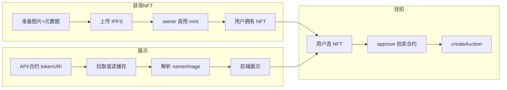

# NFT 部分处理方案

> 参考合约项目 [nft-auction](/home/cjq_ubuntu/web3/projects/nft-auction) 中的 NFTMarketplace 与 IPFS 元数据流程。

---

## 一、合约侧（nft-auction）

### 1.1 NFTMarketplace.sol

- **合约**：`src/nft/NFTMarketplace.sol`，ERC721 + ERC721URIStorage
- **铸造**：`mint(address to, string memory tokenURI)`，**仅 owner 可调用**
- **销毁**：`burn(uint256 tokenId)`，持有人或 owner 可调用
- **查询**：`ownerOf`、`tokenURI`、`nextTokenId`、`totalSupply`

### 1.2 谁可以拿到 NFT

| 方式 | 说明 |
|------|------|
| 合约 owner 铸造 | 后端/运营用私钥调用 `mint(to, tokenURI)` 铸给用户地址 |
| 已有 NFT | 若支持其他 ERC721，用户也可用自己已有的 NFT 来创建拍卖 |

当前项目里，**NFT 来源只有「合约 owner 铸给用户」**，普通用户不能自己 mint。

### 1.3 tokenURI 内容

- 铸造时传入的 `tokenURI` 一般为 **元数据 JSON 的 URI**（如 `ipfs://Qm...` 或 `https://...`）
- 该 JSON 建议包含：`name`、`description`、`image`（及可选 `attributes` 等）
- 规范与示例见 nft-auction 项目：`docs/IPFS元数据上传指南.md`

### 1.4 创建拍卖时的 NFT 要求

- 调用 `createAuction(nftContract, tokenId, ...)` 时，**msg.sender 必须是该 tokenId 的 owner**
- 调用前需先对该 NFT 做 **approve 或 setApprovalForAll**，授权拍卖合约转移该 NFT

---

## 二、API 侧（nft-auction-api）

### 2.1 职责

- 提供 **NFT 元数据查询**：`GET /api/nfts/:contract/:tokenId`
- 对链上 `tokenURI` 做 **拉取 + 解析 + 缓存**，写入 `t_nft_metadata`

### 2.2 元数据来源与流程

1. 读合约 `tokenURI(tokenId)` 得到 URI（如 `ipfs://Qm...`）
2. 通过 HTTP 拉取（IPFS 需经网关，如 `https://gateway.pinata.cloud/ipfs/Qm...`）
3. 解析 JSON，取出 `name`、`description`、`image` 等
4. 写入或更新 `t_nft_metadata`，后续请求优先走缓存

### 2.3 IPFS URI 处理

- 若 `tokenURI` 为 `ipfs://QmXXX`，需转为网关 URL 再请求，例如：
  - `https://gateway.pinata.cloud/ipfs/QmXXX`
  - `https://ipfs.io/ipfs/QmXXX`
- 可在 API 中配置默认网关，或提供网关列表由前端配合使用

### 2.4 可选：主动预热缓存

- 监听合约 `AuctionCreated` 等事件，拿到 `nftContract` + `tokenId`
- 对该 NFT 调用一次元数据拉取并写入 `t_nft_metadata`，避免首请求慢

---

## 三、前端侧（nft-auction-web）

### 3.1 展示 NFT

- **列表/详情**：优先用 API 返回的拍卖数据（已含或可含 `nft.name`、`nft.image` 等）
- **单独查 NFT**：`GET /api/nfts/:contract/:tokenId` 拿元数据
- **图片**：若 API 返回的 `image` 为 `ipfs://...`，前端需用网关 URL 展示，例如  
  `image.replace('ipfs://', 'https://gateway.pinata.cloud/ipfs/')`

### 3.2 用户如何获得 NFT（当前合约设计）

- **仅 owner 可 mint**：普通用户不能在前端直接“铸造”。
- 可选做法：
  1. **运营后台**：由管理员用脚本/后台调用 `mint(to, tokenURI)` 铸给用户地址；
  2. **前端展示**：用户连接钱包后，用 `ownerOf` / `balanceOf` 或 API 的「我的 NFT」接口，列出其地址拥有的 NFT，再选择其中一个去创建拍卖。

### 3.3 创建拍卖前的准备

1. 用户选择要拍卖的 NFT（合约地址 + tokenId）
2. 前端调用 NFT 合约的 `approve(auctionContractAddress, tokenId)` 或 `setApprovalForAll(auctionContractAddress, true)`
3. 用户确认后，再调用拍卖合约的 `createAuction(nftContract, tokenId, duration, minBidUSD, paymentToken)`

### 3.4 前端可选：上传图片/元数据

- 若希望用户“上传图片、生成元数据再由运营去铸”，可在前端做：
  - 上传图片到 Pinata（或其它 IPFS 服务）
  - 生成符合 [IPFS元数据上传指南](https://github.com/example/nft-auction/blob/main/docs/IPFS元数据上传指南.md) 的 JSON
  - 上传 JSON 得到元数据 URI，**将 URI 交给后端/运营**，由合约 owner 调用 `mint(to, tokenURI)` 完成铸造

---

## 四、整体流程简图

---

## 五、与 nft-auction 的对应关系

| 项目内 | 路径/说明 |
|--------|------------|
| NFT 合约接口 | `src/interfaces/INFTMarketplace.sol` |
| NFT 合约实现 | `src/nft/NFTMarketplace.sol` |
| 元数据规范与 IPFS | `docs/IPFS元数据上传指南.md` |
| 铸造脚本示例 | `script/deploy/DeployNFT.s.sol`、文档中的 cast 命令 |

---

## 六、建议实现顺序

1. **API**：实现从 `tokenURI` 拉取 JSON、解析并写入 `t_nft_metadata`；IPFS 用固定网关替换 `ipfs://`。
2. **前端**：列表/详情用 API 的拍卖与 NFT 字段展示；图片统一用网关 URL。
3. **运营**：提供脚本或后台，用合约 owner 私钥调用 `mint(to, tokenURI)`，把 NFT 铸给指定地址。
4. **前端**：可选「我的 NFT」列表（读链或 API），选择后 approve + createAuction。
